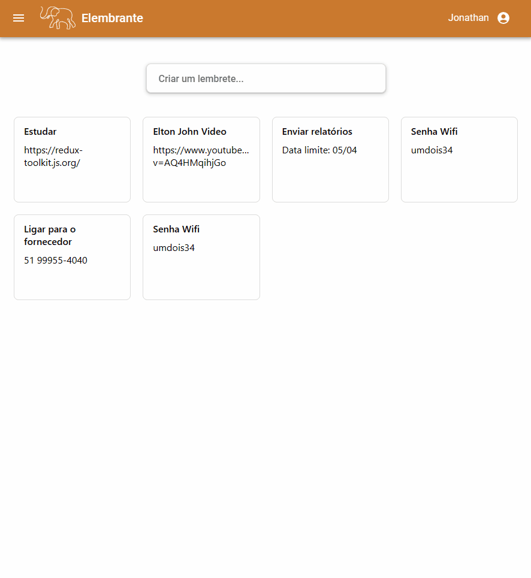

#### Aplicação para gerencimento de lembretes/notas.

## IT'S LIVE!

A aplicação está disponível [neste link](https://elembrante.vercel.app/).



## Login

Cadastre-se ou utilize sua conta Google!

<div align='center'>


</div>

## Rodando localmente*

Para rodar o projeto localmente, são necessárias apenas duas etapas.

**1 -** Clone o repositório e execute o comando abaixo para instalar todas as dependências:

```
npm install
```

**2 -** Inicialize a aplicação executando:

```
npm start
```

Dirija-se ao endereço `http://localhost:3000` para visualizar a aplicação.

#### *Certifique-se de ter [Node.js](https://nodejs.org/en/) instalado em sua máquina.
